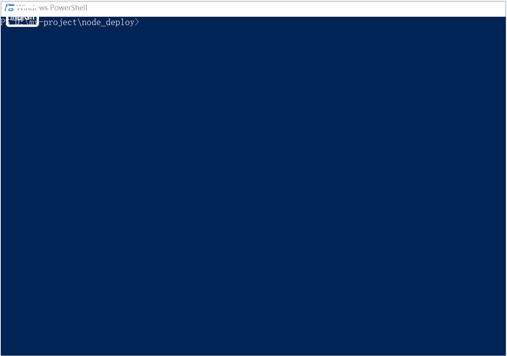

# webfront-auto-deploy
基于nodejs写的一个web前端自动发包小工具
;
# 使用说明
+ 将`auto-deploy`目录拷贝至你的项目根目录中
+ 编辑`auto-deploy`目录下的`deployConfig.js`
```$xslt
// 需上传的压缩包的路径
const zipPath = '../xxx.zip';

// 发包配置
module.exports = {
  sshConfig: { // 具体配置见 https://www.npmjs.com/package/node-ssh
    host: 'xxx.xxx.xxx.xxx', // 服务器地址
    username: 'xxx', // 服务器用户名，如root
    privateKey: '../xxx.pem', // 方式一：使用密钥文件连接服务器。连接服务器的密钥文件，一般是以.pem结尾
    // password: 'xxx', //方式二 用密码连接服务器
  },
  /* 需要运行的npm脚本命令（如：npm run build），自动发包会在该命令执行完成后再执行。在该命令中一般可以生产压缩包文件，
压缩包文件未生成是上传不了的 */
  npmScript: 'npm run build', 
  deployPath: '/xxx/xxx/xxx/xxx', // 服务器端前端包存储目录，如: /mnt/data/www/testNodeDeploy
  zipPath: path.resolve(__dirname, zipPath), // 要上传的压缩包路径
  zipStoragePath: '', // 服务器端压缩包存储目录， 默认为deployPath的上一级目录
  zipBackupName: '', // 服务器端压缩包备份名称，默认为 压缩包名称+_backup
};
```
+ 在项目根目录打开命令行终端，输入`node ./auto-deploy/autoDeploy.js`然后敲回车执行即可
